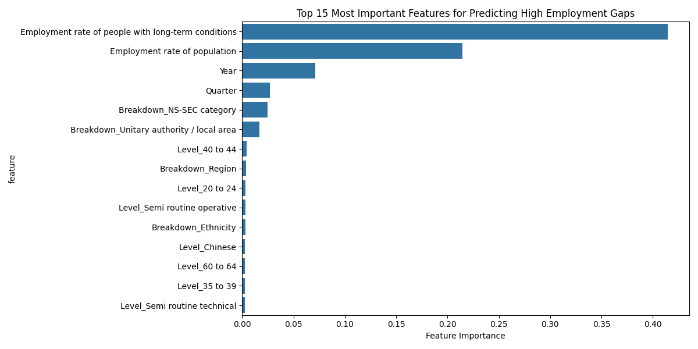
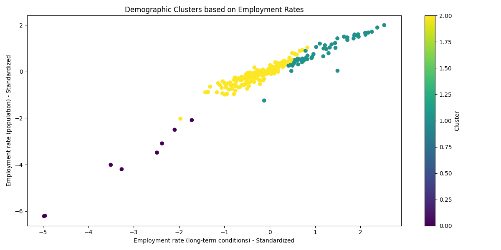

# NHS Chronic Employment Analysis

## Overview
Analysis of employment rates and gaps between the general population and people with long-term conditions in England, using ONS Labour Force Survey data (2006-2018). The dataset is sourced from the NHS Outcomes Framework Indicator 2.2, which measures the difference in employment rates between the general working-age population and those reporting long-term health conditions.

## Analysis Results

### Overall Employment Trends
- Total population showed steady growth from 2006 to 2018
- Long-term condition numbers remained relatively stable at 25-30% of population
- Persistent employment gap exists between general population and those with long-term conditions
- Slight narrowing of gap in recent years indicates improving workplace inclusivity

### Key Demographic Findings

#### Gender
- Women with long-term conditions face larger employment gaps
- Men show consistently higher employment rates across both groups
- Recent years show slight improvement in reducing gaps for both genders

#### Ethnicity
- Chinese workers show unique negative gap (-2.53%), suggesting higher employment rates for those with long-term conditions
- White and Other ethnic groups show similar gaps (~13.7%)
- Black/African/Caribbean groups show lower gaps (~9.8%)

#### Regional Variations
- Merseyside shows highest average gap (16.77%)
- South East shows lowest gap (10.84%)
- London's gap (13.97%) above national average despite economic strength
- Clear north-south divide in employment outcomes

#### Religion
- Jewish communities show lowest average gap (7.31%)
- Christian and Muslim communities show similar gaps (~13%)
- High variability in employment gaps for Buddhist and Sikh communities

### Technical Sector Analysis
- Clear correlation between role complexity and employment accessibility
- Higher professional roles show smaller gaps (5.16-6.36%)
- Semi-routine technical roles show larger gaps (14.00%)
- Employment rates for those with long-term conditions vary significantly:
  * Higher professional: 87.36% employment rate
  * Semi-routine technical: 71.08% employment rate

### Key Implications
1. Despite overall employment growth, significant barriers remain for people with long-term conditions
2. Demographic factors significantly influence employment outcomes
3. Technical sector shows clear stratification in employment accessibility
4. Regional disparities suggest need for targeted interventions
5. Professional and higher-skilled roles show better integration of workers with long-term conditions

## Machine Learning Analysis

### Feature Importance Analysis
Question: What factors most strongly influence employment gaps between the general population and those with long-term conditions?

Using Random Forest classification (94.6% accuracy), the analysis revealed:
- General population employment rate is by far the most influential feature (0.25 importance)
- Year and Quarter are the second most important (0.15 and 0.07 respectively)
- Demographic breakdowns (NS-SEC category, local area) have moderate importance (0.02 importance)

This suggests that current employment status is more predictive of employment gaps than demographic factors.

### Demographic Clustering Analysis
Question: Are there distinct patterns in employment outcomes across different demographic segments?

K-means clustering revealed three distinct groups:

1. Small Cluster (n=8):
   - Lowest employment rates (~23% for long-term conditions, ~27% population)
   - Primarily NS-SEC categories and Age groups
   - Smallest employment gap (4.2%)

2. Medium Cluster (n=59):
   - Highest employment rates (~75% for long-term conditions, ~83% population)
   - Mix of NS-SEC and local area categories
   - Moderate employment gap (8.0%)

3. Large Cluster (n=175):
   - Moderate employment rates (~58% for long-term conditions, ~72% population)
   - Dominated by local area categories
   - Largest employment gap (13.5%)

The clustering analysis reveals that employment outcomes tend to cluster by demographic category type rather than specific demographic characteristics, suggesting systemic patterns in how employment gaps manifest across different population segments.

## Data Source
- Primary Source: [ONS Labour Market Statistics](https://www.ons.gov.uk/employmentandlabourmarket/peopleinwork/employmentandemployeetypes/bulletins/uklabourmarket/previousReleases)
- Secondary Source: [NHS Outcomes Framework - February 2020 publication](https://digital.nhs.uk/data-and-information/publications/statistical/nhs-outcomes-framework/february-2020)
- Time Period: 2006-2020
- Key Metrics: Employment rates, population counts, and employment gaps across various demographic breakdowns
